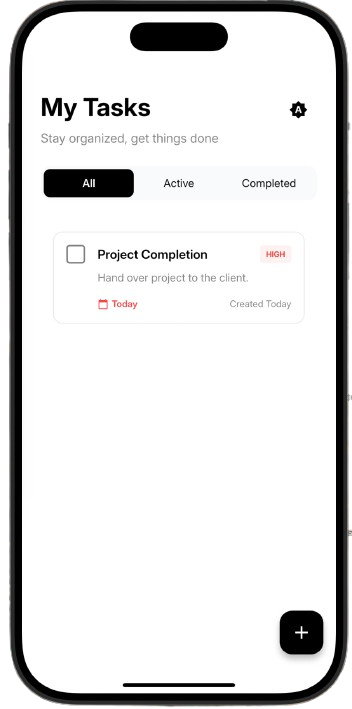
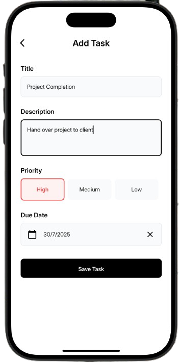
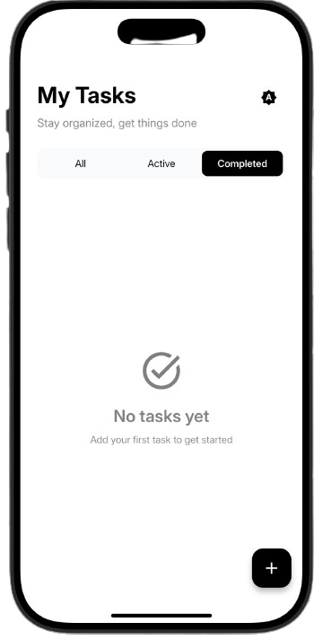
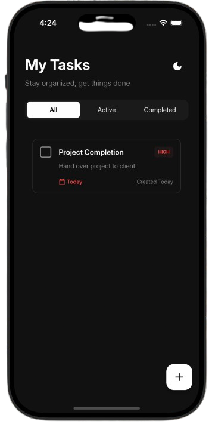
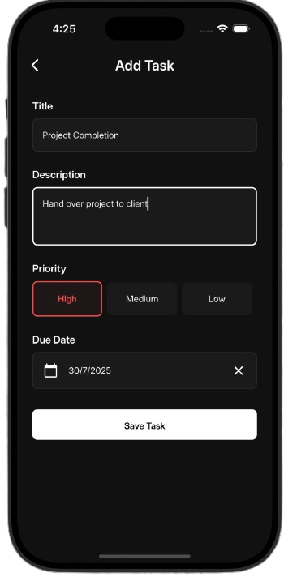
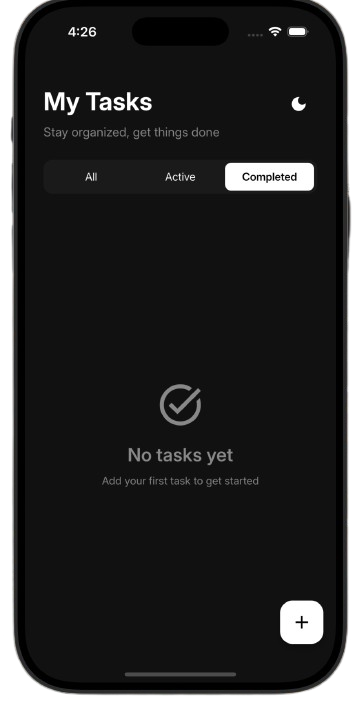

# Minimal Todo App

A clean, efficient Flutter task management application built with Clean Architecture principles, BLoC state management, and local data persistence using Hive.

## 🏗️ Architecture

This project follows **Clean Architecture** principles with clear separation of concerns across three main layers:

### Architecture Layers

```
┌─────────────────────────────────────────────────────────┐
│                   Presentation Layer                    │
├─────────────────────────────────────────────────────────┤
│                    Domain Layer                         │
├─────────────────────────────────────────────────────────┤
│                     Data Layer                          │
└─────────────────────────────────────────────────────────┘
```

#### 🎨 Presentation Layer (`lib/presentation/`)

- **BLoC Pattern**: State management using `flutter_bloc`
  - `TaskBloc`: Manages task CRUD operations
  - `FilterBloc`: Handles task filtering (All, Pending, Completed)
  - `ThemeBloc`: Controls app theme switching
- **Pages**: Screen-level widgets with clear navigation
- **Widgets**: Reusable UI components organized by feature
- **Utils**: Presentation-specific utilities

#### 🎯 Domain Layer (`lib/domain/`)

- **Entities**: Pure Dart objects representing core business models
- **Use Cases**: Single-responsibility business logic operations
  - `AddTaskUsecase`, `DeleteTaskUsecase`, `UpdateTaskUsecase`
  - `GetTasksUsecase`, `GetTaskByIdUsecase`
  - `ToggleTaskCompletionUsecase`
- **Repository Contracts**: Abstract interfaces for data operations

#### 💾 Data Layer (`lib/data/`)

- **Data Sources**: Local storage implementation using Hive
- **Models**: Data transfer objects with JSON serialization
- **Repository Implementation**: Concrete implementation of domain contracts

### 🔧 Core Infrastructure (`lib/core/`)

- **Error Handling**: Custom exceptions and failure types
- **Base Use Cases**: Generic use case interface
- **Utils**: Cross-cutting concerns like BLoC observer

### ⚙️ Configuration (`lib/config/`)

- **Dependency Injection**: GetIt setup for IoC container
- **Constants**: App-wide constants (colors, dimensions, strings)
- **Themes**: Material Design theme configuration

## 🎨 Design Decisions

### State Management

- **BLoC Pattern**: Chosen for its predictability, testability, and separation of business logic from UI
- **Event-Driven**: Clear separation between user actions (events) and app state changes

### Data Persistence

- **Hive Database**: Lightweight, fast NoSQL database perfect for local task storage
- **Type Adapters**: Custom serialization for complex objects

### Architecture Benefits

- **Testability**: Each layer can be tested in isolation
- **Maintainability**: Clear boundaries and single responsibility
- **Scalability**: Easy to add new features without affecting existing code
- **Dependency Inversion**: High-level modules don't depend on low-level modules

### UI/UX Decisions

- **Material Design**: Consistent with platform conventions
- **Theme Support**: Light/dark mode toggle for user preference
- **Responsive Design**: Adaptive layouts using `SizeConfig`
- **Clean Interface**: Minimal, distraction-free task management

## 🚀 Getting Started

### Prerequisites

- Flutter SDK (>=3.0.0)
- Dart SDK (>=2.17.0)
- Android Studio / VS Code with Flutter extensions

### Installation

1. **Clone the repository**

   ```bash
   git clone https://github.com/upretisaurav/minimal-todo.git
   cd minimal-todo-app
   ```

2. **Install dependencies**

   ```bash
   flutter pub get
   ```

3. **Generate model files** (if needed)

   ```bash
   flutter packages pub run build_runner build
   ```

4. **Run the app**
   ```bash
   flutter run
   ```

### Building for Production

**Android APK**

```bash
flutter build apk --release
```

**iOS IPA**

```bash
flutter build ios --release
```

## Features

- **Create Tasks**: Add new tasks with title and description
- **Edit Tasks**: Modify existing task details
- **Delete Tasks**: Remove unwanted tasks
- **Toggle Completion**: Mark tasks as completed/pending
- **Filter Tasks**: View All, Pending, or Completed tasks
- **Theme Toggle**: Switch between light and dark modes
- **Offline Storage**: All data persisted locally using Hive
- **Real-time Updates**: Instant UI updates with BLoC state management

## 📂 Project Structure

```
lib/
├── main.dart                    # App entry point
├── config/                      # App configuration
│   ├── constants/              # App constants
│   ├── injector/               # Dependency injection
│   └── themes/                 # Theme configuration
├── core/                       # Core utilities
│   ├── error/                  # Error handling
│   ├── usecases/              # Base use case
│   └── utils/                  # Core utilities
├── data/                       # Data layer
│   ├── data_sources/local/    # Local data sources
│   ├── models/                # Data models
│   └── repositories/          # Repository implementations
├── domain/                     # Domain layer
│   ├── entities/              # Business entities
│   ├── repositories/          # Repository contracts
│   └── usecases/              # Business use cases
├── presentation/               # Presentation layer
│   ├── blocs/                 # BLoC state management
│   ├── pages/                 # App screens
│   ├── utils/                 # Presentation utils
│   └── widgets/               # Reusable widgets
└── routes/                     # Navigation setup
```

## 🔨 Development Tools

- **State Management**: flutter_bloc
- **Local Database**: hive, hive_flutter, shared_preferences
- **Dependency Injection**: get_it
- **Code Generation**: build_runner, json_annotation
- **Navigation**: go_router
- **Logging**: logger

## 📸 Screenshots

### Light Theme

<p align="center">
  
  
  
</p>

### Dark Theme

<p align="center">
  
  
  
</p>

## 🎥 Demo Video

[](https://youtube.com/shorts/NWcu_qOWkPI)
